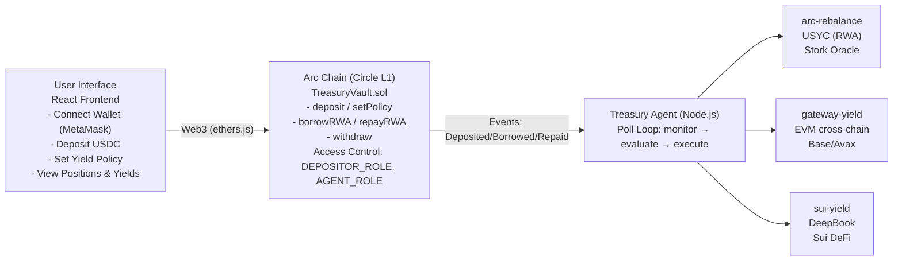
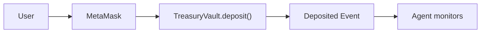
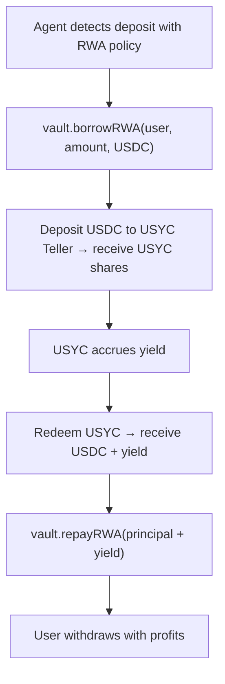
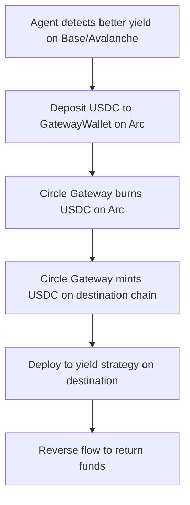

# TreasuryForge Architecture

## Overview

TreasuryForge is an autonomous RWA-backed treasury optimizer that runs on Circle's Arc chain. It uses an AI agent to monitor yields across multiple fronts and automatically rebalances funds to maximize returns while maintaining liquidity.

## System Architecture



## Data Flow

### Deposit Flow


### Yield Generation Flow (RWA - Bounty 3)


### Cross-Chain Flow (Gateway - Bounty 1, Phase 2)


## Smart Contract Architecture

### TreasuryVault.sol

```solidity
// User deposits
mapping(address => Deposit) public userDeposits;

// User yield policies
mapping(address => YieldPolicy) public policies;

// Agent tracking
mapping(address => BorrowRecord) public borrowedRWA;

// Access control
bytes32 public constant AGENT_ROLE = keccak256("AGENT_ROLE");
bytes32 public constant DEPOSITOR_ROLE = keccak256("DEPOSITOR_ROLE");
```

### Key Functions

| Function | Access | Description |
|----------|--------|-------------|
| `deposit(amount)` | DEPOSITOR | Deposit USDC into vault |
| `setPolicy(...)` | DEPOSITOR | Set yield preferences |
| `borrowRWA(user, amount, asset)` | AGENT | Borrow for yield generation |
| `repayRWA(amount)` | AGENT | Return principal + yield |
| `withdraw(amount)` | DEPOSITOR | Withdraw funds |

## Plugin Architecture

Each plugin implements:

```typescript
interface Plugin {
  name: string;

  // Check yields and return opportunities
  monitor(ctx: PluginContext): Promise<YieldOpportunity[]>;

  // Decide if we should act
  evaluate(opportunities: YieldOpportunity[], ctx: PluginContext): Promise<boolean>;

  // Execute rebalancing actions
  execute(ctx: PluginContext): Promise<RebalanceAction[]>;
}
```

### arc-rebalance Plugin

**Purpose**: Manage RWA yield via USYC (tokenized money market fund)

**Flow**:
1. Monitor Stork oracle for yield rates
2. Evaluate against threshold (5% APY)
3. Execute:
   - Borrow from vault
   - Deposit to USYC Teller
   - Track position maturity (2 min demo / configurable prod)
   - Redeem USYC with yield
   - Repay vault

**Mock Mode**: When agent is not USYC-allowlisted, simulates 5% APY for demo

### gateway-yield Plugin

**Purpose**: Cross-chain yield optimization via Circle Gateway

**Supported Chains**:
| Chain | Network | Chain ID |
|-------|---------|----------|
| Arc | Testnet | 5042002 |
| Ethereum | Sepolia | 11155111 |
| Base | Sepolia | 84532 |
| Avalanche | Fuji | 43113 |

**Flow**:
1. Monitor yields across all supported chains
2. Compare against Arc yield (home chain)
3. If better yield elsewhere (>1% difference):
   - Borrow from vault on Arc
   - Deposit to GatewayWallet (burns USDC on Arc)
   - Mint on destination chain via GatewayMinter
   - Deploy to yield protocol (simulated in demo)
   - After hold period, reverse flow to return funds
   - Repay vault with profit

**Mock Mode**: Simulates cross-chain operations when Gateway calls fail

## External Integrations

### Stork Oracle
- **Endpoint**: `https://rest.jp.stork-oracle.network/v1/prices/latest`
- **Auth**: Basic authentication
- **Usage**: Real-time yield data for decision making
- **Fallback**: 6.5% mock yield when no API key

### USYC (Hashnote)
- **Token**: `0xe9185F0c5F296Ed1797AaE4238D26CCaBEadb86C`
- **Teller**: `0x9fdF14c5B14173D74C08Af27AebFf39240dC105A`
- **Entitlements**: `0xcc205224862c7641930c87679e98999d23c26113`
- **Requirement**: Wallet allowlisting for production

### Circle Gateway (Phase 2)
- **GatewayWallet**: `0x0077777d7EBA4688BDeF3E311b846F25870A19B9`
- **GatewayMinter**: `0x0022222ABE238Cc2C7Bb1f21003F0a260052475B`
- **Supported Chains**: Arc, Ethereum Sepolia, Base Sepolia, Avalanche Fuji

## Security Model

### Access Control
- Vault uses OpenZeppelin AccessControl
- Agent role is explicitly granted to agent wallet
- Users can only manage their own deposits

### Safety Mechanisms
- Policy-based borrowing limits (maxBorrowAmount)
- Risk level settings (low/medium/high)
- Users can withdraw anytime (subject to liquidity)
- Agent cannot exceed policy limits

### Mock Mode Safety
- When not allowlisted for USYC, agent simulates yields
- No actual funds leave the vault in mock mode
- Clear logging indicates `[SIMULATED]` operations

## Deployment

### Contract Addresses (Arc Testnet)

| Contract | Address |
|----------|---------|
| TreasuryVault | `0x28c122d7ec06e48ebe7d32da190f09313c2b6bb4` |
| USDC | `0x3600000000000000000000000000000000000000` |
| USYC Token | `0xe9185F0c5F296Ed1797AaE4238D26CCaBEadb86C` |
| USYC Teller | `0x9fdF14c5B14173D74C08Af27AebFf39240dC105A` |

### Environment Variables

```bash
# Arc Chain
ARC_RPC_URL=https://rpc.testnet.arc.network
ARC_VAULT_ADDRESS=0x28c122d7ec06e48ebe7d32da190f09313c2b6bb4
ARC_USDC_ADDRESS=0x3600000000000000000000000000000000000000

# USYC (RWA)
ARC_USYC_ADDRESS=0xe9185F0c5F296Ed1797AaE4238D26CCaBEadb86C
ARC_USYC_TELLER=0x9fdF14c5B14173D74C08Af27AebFf39240dC105A

# Agent
PRIVATE_KEY=<agent-wallet-private-key>
STORK_API_KEY=<stork-api-key>
AGENT_POLL_INTERVAL=300000
```

## Bounty Alignment

### Bounty 3: Agentic Commerce with RWA ($2,500)
- ✅ Agent uses Circle RWA (USYC)
- ✅ Autonomous yield generation
- ✅ Complete borrow → yield → repay cycle
- ✅ Policy-based decision making

### Bounty 1: Chain Abstracted USDC Apps ($5,000)
- ✅ Circle Gateway integration
- ✅ Cross-chain yield optimization (Arc ↔ Ethereum ↔ Base ↔ Avalanche)
- ✅ Unified USDC balance abstraction via GatewayWallet/GatewayMinter
